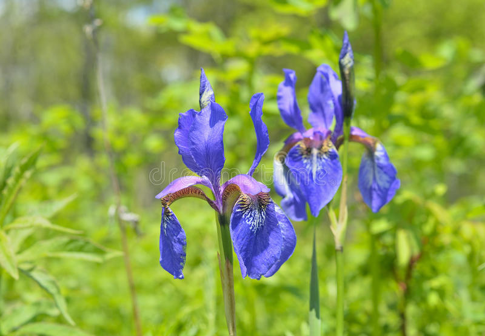
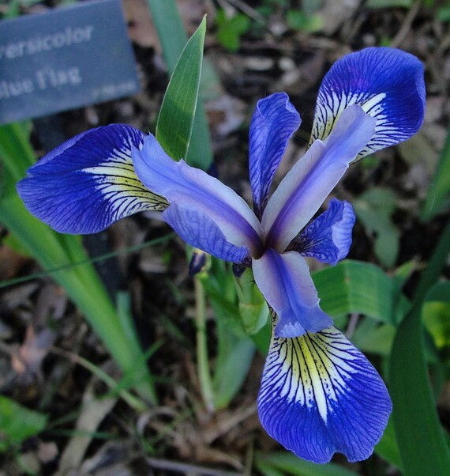

# Clasificador Bayesiano
Proyecto final de la materia Matemáticas II.

Profesor: Dr. Arturo Baltazar

Objetivo: Desarrollar un clasificador bayesiano para clasificar dos tipos de flores (setosa  y versicolor), de acuerdo al ancho y largo del sépalo y pétalo.

### Imágenes a classificar

  

 Figura 1. Setosa. 

  

 Figura 1. Versicolor. 

### Distribución de las mediciones

  

 Figura 1. Distribución petal. 

  

 Figura 1. Distribución sepal. 

